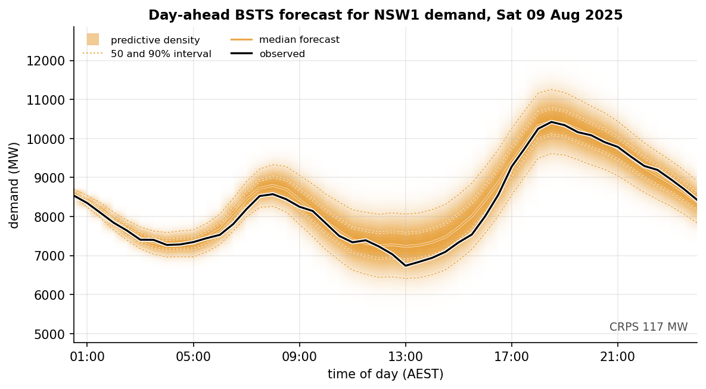
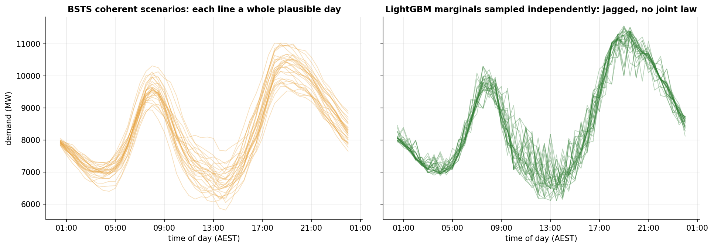

# nem-demand-forecast

Electricity has to be generated at the instant it is used, so the people who run
the grid live by the day-ahead forecast. Under-call the evening peak and the
market scrambles for expensive last-minute power; over-call it and you have paid
to hold reserves nobody needed. This project is a probabilistic day-ahead
forecaster for NSW1 demand in the Australian National Electricity Market: the
output is not a single number but the whole distribution of tomorrow's demand,
half hour by half hour.



One test day, called from its midnight origin off the weather forecast on hand the
day before.

- Black line: the demand that arrived. Amber line: the predictive median.
- The colour is the predictive density, deepest where tomorrow's demand is most
  likely, with the central 50 and 90 percent intervals as dotted lines.
- The observed day stays inside the bands throughout, tight overnight and widening
  across the 18:00 peak where the call is hardest.

An operator does not want the single most likely number for the peak, they want to
know how high the tail could reach, and a calibrated density is what tells them.



Underneath that fan sit whole days. Both panels draw scenarios for one example
day, its clock and weather features given but no outcome fixed.

- Left: the BSTS samples each line jointly across all 48 half hours, so every one
  is a physically plausible day.
- Right: all LightGBM can offer is per-step quantiles with no joint law, so a path
  is stitched from an independent draw at each half hour and comes out jagged.

The difference bites the moment a decision spans the whole day:

- Sum the 48 steps for the day's total energy and the coherent draws give it with
  an honest spread; the independent marginals add up half hours they have pretended
  are unrelated and badly understate it.
- A step-to-step quantity like the ramp the marginals cannot give at all.

Whole-day decisions need the joint law, which is why the headline forecaster is
Bayesian. [Notebook 06](notebooks/06_bayes_vs_lightgbm.ipynb) measures the gap.

The raw material is three years of half-hourly NSW1 demand. Forecasts run 48 steps
ahead, issued twice a day, scored on a season-blocked test set that covers every
month of the evaluation year under the weather forecasts on hand the day before,
with nothing allowed to peek at the future.

The aim is a Bayesian forecaster that at least matches a strong classical baseline
on raw accuracy and beats it where a probabilistic forecast should be judged:

- density quality
- calibration
- short-lead sharpness
- coherent whole-day scenarios

The project also keeps an honest account of what the Bayesian machinery brings and
what it costs.

## The models

| Model | Predictive form | Role |
| --- | --- | --- |
| Seasonal naive | Gaussian band from weekly-naive errors | the floor and the MASE base |
| Dynamic harmonic regression + AR(2) errors | analytic Gaussian | classical baseline |
| LightGBM, 15 quantile heads | regularised quantiles | industry benchmark |
| BART, two heads (mean and log scale) | posterior predictive draws | Bayesian trees against LightGBM |
| BSTS: regression with a heteroskedastic AR([1,2]) error | posterior predictive paths | the Bayesian forecaster |

Every model reads one shared design matrix:

- local-clock seasonal harmonics
- temperature, dew point and irradiance
- degree days, a piecewise-linear temperature spline for the convex
  demand-temperature response, and thermal-inertia degree days (trailing 24 and 48
  hour averages)
- demand lags and holidays

On top of that shared design:

- The tree models get origin-anchored recency features (last observed demand
  against its day-ago and week-ago values, the recent slope and curvature, plus the
  lead time), the information the BSTS carries inside its AR error dynamics.
- The BSTS error is an AR([1,2]). An AR(1) error carries only the residual level
  forward, an AR(2) carries a level and a slope, so the forecast near the origin
  tracks the day's momentum. The ARIMA, choosing its own order on validation,
  independently lands on AR(2) too, so the second lag is a real feature of the
  residuals rather than a Bayesian artefact.
- The observation scale is heteroskedastic, growing and shrinking with the hour of
  day, as the EDA asks.

## How the project unfolds

1. **Data and baseline** (notebooks 01 and 02). Three years of NSW1 demand, ERA5
   reanalysis and archived ECMWF IFS forecasts; cleansing, timezone checks, the
   non-linear structure, and the committed season-blocked splits. Choosing the
   ARIMA order on validation gives the classical baseline.
2. **The BSTS** (notebook 03). A seasonal regression with a stationary AR([1,2])
   error and a heteroskedastic scale, fitted by full-rank ADVI. The likelihood is written
   on the innovations, so there is no sequential scan and it fits in seconds, and it
   leads the field on log score and short-lead sharpness.
3. **Inference** (notebook 04). From cold starts NUTS wanders into degenerate
   modes; warm-started from the variational fit the chains settle into the mode the
   data prefer, so the warm start is what makes the sampler work at all. I check the
   variational fit against the certified reference and benchmark both devices; the
   likelihood is pure matrix arithmetic, so the GPU wins.
4. **Comparison** (notebook 05). Log score and calibration first, then CRPS,
   pinball, MASE, coverage, PIT and the energy score over whole paths, with
   paired-bootstrap significance, a weather-degradation sweep, the hardest day of
   the year and the compute bill.
5. **Head to head** (notebook 06). The two strongest models win on different
   things: LightGBM takes the lower marginal CRPS and a simpler fit; the BSTS is
   sharper at short lead and produces the coherent 48-step scenarios LightGBM
   cannot, a full density, and a split of its uncertainty into the part more data
   would remove and the part it would not.
6. **Operations** (notebook 07). The BSTS as a control-room forecaster on a real
   winter peak: the live forecast, how it sharpens across intraday re-issues, the
   probability of a spike against the record, and the ramp, stress-duration and
   reserve numbers an operator reads, all from one coherent predictive.

## Results

The metrics that lead are the log score and calibration, not a single error
number. On the test set, under archived forecast weather, averaged over all twelve
evaluation months, from [notebook 05](notebooks/05_model_comparison.ipynb):

| model | log score (nats) | 50% coverage | 95% coverage | CRPS (MW) |
| --- | --- | --- | --- | --- |
| BSTS | 7.38 | 0.54 | 0.91 | 248 |
| BART | 7.48 | 0.59 | 0.98 | 283 |
| ARIMA AR(2) | 7.63 | 0.61 | 0.91 | 270 |
| seasonal naive | 8.04 | 0.56 | 0.94 | 490 |
| LightGBM | none (no density) | 0.36 | 0.86 | 191 |

The BSTS posts the best log score in the field (7.38 against ARIMA's 7.63 and
BART's 7.48) and the best calibration, its 50 percent interval covering 54 percent
of outcomes.

- It now also beats ARIMA on CRPS at every lead (248 against 270, paired bootstrap
  p < 0.001) and takes the energy score over whole paths (2232 against 2316).
- LightGBM still wins the single-number CRPS by a clear margin (191 MW), but it
  carries no density, so no log score, and its intervals are overconfident: the
  nominal 95 percent band catches 86 percent and the 50 percent band only 36.
- The BSTS is the sharpest in the field through the first two hours (74 against
  LightGBM's 159 MW at 30 minutes) before the flexible tree mean pulls ahead at
  longer lead.

The absolute scores run high because handling every season at once is hard. The
ranking is the story.


## Repository layout

- `src/nemforecastdemand/`: the package. `data/` (AEMO and Open-Meteo loaders),
  `features/` (calendar, weather, perturbations), `models/` (shared design and
  inputs, ARIMA, LightGBM, BART, the innovations-form BSTS, the ADVI and NUTS
  drivers, prediction), `evaluation/` (proper scores, calibration, sampler
  diagnostics, posterior divergence), `splits.py`, `plotting.py`.
- `scripts/`: the download, build and fit entry points; every fit writes
  `artifacts/{name}.npz` plus a `.json` of metadata that the notebooks read.
- `notebooks/`: the seven-notebook narrative laid out above.
- `tests/`: scoring rules (sample CRPS against the analytic Gaussian), features,
  splits, loaders, the innovations likelihood (against a hand computation), the
  posterior KL primitives and a leakage audit. The audit pins down no-look-ahead:
  training precedes every evaluation window, both evaluation sets span all twelve
  months with balanced slots, design rows do not change when the future is deleted,
  and the scalers and perturbation calibration see the training block only.

## Task and data

- **Target:** NSW1 `TOTALDEMAND` (the AEMO price-and-demand archive), five-minute
  dispatch averaged to half hours, May 2023 to May 2026, stored in UTC and shown in
  AEST.
- **Origins:** 00:00 and 12:00 AEST daily, 48 half hours each.
- **Weather:** ERA5 actuals and archived ECMWF IFS forecasts as issued one day
  earlier (the Open-Meteo previous-runs API). The headline scores use the archived
  forecasts; perfect foresight and a calibrated error-inflation sweep are reported
  as variants.
- **Splits:** season-blocked. Everything before June 2025 is one contiguous
  training block; each evaluation month contributes an early and a late five-day
  window, and a balanced seeded draw sends one to validation and the other to test.
  Validation chooses settings; the test set is touched once.

## Reproduction

```bash
mamba env create -f environment.yml
conda activate nem-demand-forecast
pip install -e .

python scripts/download_aemo.py        # price-and-demand CSVs -> data/raw, data/interim
python scripts/download_weather.py     # Open-Meteo ERA5 + previous-runs -> data/raw
python scripts/build_dataset.py        # processed panel + split labels (committed)
python scripts/fit_arima.py            # order selection + train-only fit
python scripts/fit_gbdt.py             # LightGBM quantile heads
python scripts/fit_bart.py             # two-head BART, tree count selected on validation
python scripts/fit_bsts_innovations.py # the BSTS: ADVI + NUTS
```

Or chain every fit and then execute every notebook in order with
`bash scripts/run_all.sh` (pass `fits` or `notebooks` to run a single stage).

- The processed panel and split labels are committed, so the fit scripts and
  notebooks run with no downloads.
- JAX picks up a CUDA GPU automatically (`pip install "jax[cuda12]"`); the BSTS
  likelihood is pure matrix arithmetic, so it runs fastest there, and the notebooks
  report timings for both devices.
- `pytest` and `ruff` run in CI on every push.

## Data licences and attribution

- AEMO demand data are used under [AEMO's copyright permissions](https://www.aemo.com.au/privacy-and-legal-notices/copyright-permissions).
- Weather data by [Open-Meteo](https://open-meteo.com/) (CC BY 4.0): ERA5/ERA5T
  reanalysis (Copernicus Climate Change Service) and archived ECMWF IFS
  operational forecasts. See `data/README.md` for the series, conventions and
  caveats.

## Licence

MIT for the code. The data remain under their source licences.
