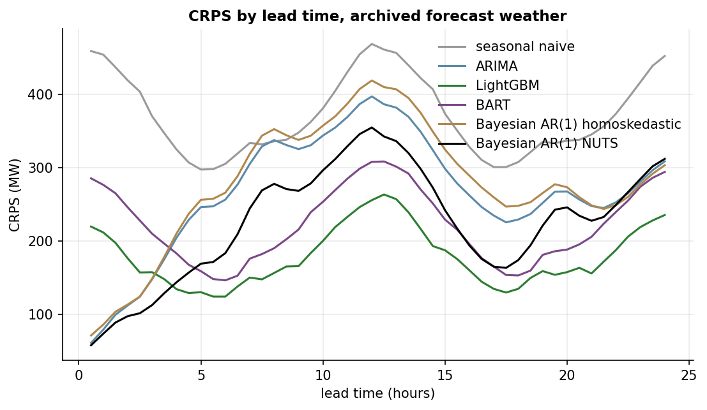
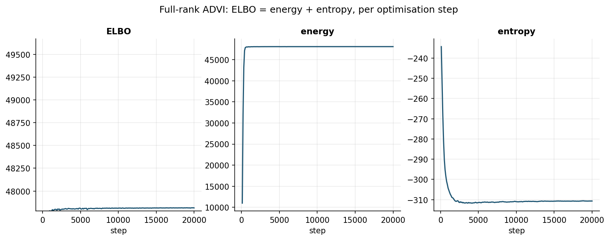
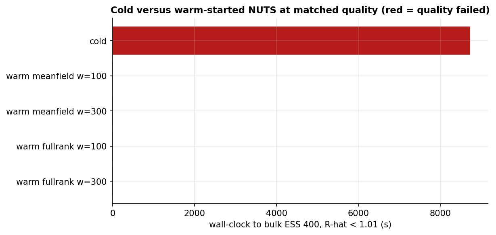

# nem-demand-forecast

Probabilistic day-ahead forecasting of NSW1 operational demand in the
Australian National Electricity Market, built as a like-for-like comparison
of inference strategies on a single Bayesian structural time-series (BSTS)
model: the same generative model is fitted by ADVI and by NUTS and both are
benchmarked against a strong classical baseline, on probabilistic accuracy,
calibration and computational cost.

## The comparison

Every model trains on the same chronological split, sees the same design
matrix (local-clock seasonal basis, temperature, dew point, direct and
diffuse irradiance, degree days, demand lags, holidays), fits the full
history before the test boundary and is scored on identical rolling test
origins under identical weather-input variants.

| Model | Predictive form | Role |
| --- | --- | --- |
| Seasonal naive | Gaussian band from weekly-naive errors | the floor and the MASE base |
| Dynamic harmonic regression + ARIMA errors | analytic Gaussian, homoskedastic | strong classical baseline |
| LightGBM, 15 quantile heads | regularised quantiles | industry point-model foil |
| BART (Bayesian additive regression trees) | posterior predictive draws | Bayesian tree ensemble against LightGBM |
| BSTS, collapsed states (~53 sampled dims) | posterior predictive paths | the inference testbed |

The BSTS is a stochastic local linear trend (damped slope) with static
seasonal regression, weather and lagged-demand regressors and a
heteroskedastic log-linear observation scale, with the latent states
marginalised analytically through a Kalman filter inside the likelihood,
so inference runs over roughly fifty hyperparameters regardless of data
length. The marginalisation is a documented finding, not a stylistic
choice: written the naive way, with every half hour's innovations as
latent draws, the model costs two dimensions per half hour, and on that
geometry cold NUTS did not complete 2,000 iterations in seventeen hours
on the GPU while the full-rank guide diverged, a dense Cholesky over
thousands of dimensions being underdetermined at any setting. Collapsed,
the same sampling schedule finishes in under an hour on CPU alone. The
model is fitted five ways: mean-field ADVI (`AutoNormal`), full-rank ADVI
(`AutoMultivariateNormal`), cold NUTS (the reference posterior) and
warm-started NUTS with chain positions and the frozen inverse mass matrix
taken from each surrogate (diagonal from mean-field, dense from
full-rank) over a grid of reduced warmups.

BART is the Bayesian counterpart to LightGBM: a sum-of-trees prior with
posterior uncertainty over the regression function. Its tree structures
are discrete, so neither ADVI nor NUTS applies; it is fitted by its
native particle-Gibbs sampler (`pymc-bart`) and joins the comparison on
the model-class axis with full predictive draws.

Prediction is Rao-Blackwellised for every Bayesian fit: conditional on
hyperparameter draws the model is linear-Gaussian, so rolling-origin
forecasts run a Kalman filter per draw and simulate jointly coherent
48-step paths, with no per-origin refitting.

The axes of comparison, and where each is answered:

1. **Inference algorithm at fixed model** (mean-field against full-rank
   against NUTS): posterior fidelity on marginals and correlations,
   predictive consequences, cost, and the exact aleatoric-epistemic split
   of predictive variance as an inference diagnostic. Notebooks 03 and 04.
2. **Warm-start economics**: cold total against ADVI fit plus reduced
   warmup plus sampling, judged only at matched quality (target bulk ESS,
   clean R-hat, no divergences). Notebook 04.
3. **Model class** (structural Bayesian against classical against
   gradient-boosted against Bayesian trees against naive): accuracy,
   calibration, joint-path coherence, statistical significance and
   robustness to degrading weather inputs. Notebook 05.
4. **Hardware**: the BSTS suite fitted identically on the GPU and on the
   CPU's cores (chains in parallel). Notebook 04.

## Task and data

- **Target:** NSW1 operational demand (AEMO NEMWeb `ACTUAL_HH`), half-hourly,
  May 2025 to May 2026, stored in UTC and displayed in AEST.
- **Origins:** 00:00 and 12:00 AEST daily, each forecasting 48 half hours.
- **Weather:** ERA5 reanalysis actuals and archived ECMWF IFS forecasts as
  issued one day earlier (Open-Meteo previous-runs API), so the headline
  evaluation has no look-ahead. Temperature, dew point, direct and diffuse
  irradiance.
- **Splits:** chronological 70/15/15, cut at market-day boundaries;
  validation selects the ARIMA order and seasonal basis; the test set is
  touched only by the final evaluation. The range is representative: train
  and test each straddle a Sydney daylight-saving transition (the seasonal
  basis runs on the local clock), every split contains public holidays, and
  test demand stays inside the range seen in training.
- **Weather-input variants:** archived forecast (headline), ERA5 perfect
  foresight (disclosed upper bound) and a calibrated perturbation sweep
  fitted to measured forecast-minus-ERA5 errors.

## Results

Headline test-set scores (archived forecast weather) are produced in
[notebook 05](notebooks/05_model_comparison.ipynb).







## Notebooks

1. [`01_eda_and_cleansing`](notebooks/01_eda_and_cleansing.ipynb): timestamp
   and timezone verification (including the daylight-saving shift in the
   daily shape), demand drivers, forecast-error calibration, cleansing and
   the committed splits.
2. [`02_baseline_arima`](notebooks/02_baseline_arima.ipynb): order
   selection, the trigonometric-versus-RBF basis assessment, calibration
   and test scores for the classical baseline.
3. [`03_bsts_vi`](notebooks/03_bsts_vi.ipynb): the BSTS fitted by
   mean-field and full-rank ADVI, with the ELBO decomposed into energy
   and entropy as it trains, the learned heteroskedastic variance
   profile, the aleatoric-epistemic split of predictive variance and
   posterior predictive forecasts.
4. [`04_bsts_nuts`](notebooks/04_bsts_nuts.ipynb): NUTS on the collapsed
   formulation with full diagnostics as the reference posterior, ADVI
   adjudicated against it, the honest cold-versus-warm-start accounting at
   matched effective sample size, the GPU-versus-CPU benchmark and the
   explicit-state intractability finding.
5. [`05_model_comparison`](notebooks/05_model_comparison.ipynb): the master
   table (CRPS, log score, pinball, MASE, coverage, energy score), paired
   bootstrap significance, PIT calibration, horizon-resolved skill, the
   weather-quality sweep, a worst-day case study and the compute table.

## Reproduction

```bash
mamba env create -f environment.yml
conda activate nem-demand-forecast
pip install -e .

python scripts/download_aemo.py      # NEMWeb weekly archives -> data/raw, data/interim
python scripts/download_weather.py   # Open-Meteo ERA5 + previous-runs -> data/raw
python scripts/build_dataset.py      # processed train/val/test parquet (committed)
python scripts/fit_arima.py          # order selection + full-history fit -> artifacts/
python scripts/fit_gbdt.py           # LightGBM quantile heads -> artifacts/
python scripts/fit_bart.py           # BART posterior predictive draws -> artifacts/
python scripts/fit_bsts_collapsed.py # BSTS ADVI + NUTS + warm starts -> artifacts/
```

The processed splits are committed, so the model scripts and notebooks run
without any downloads. NEMWeb retains roughly thirteen months of demand
archives; rerunning the download later requires moving the window forward
in `config/default.yaml`. A CUDA GPU is used automatically when JAX sees
one (`pip install "jax[cuda12]"`); every script also runs on CPU and the
notebooks report measured speed-ups.

`pytest` covers the scoring rules (the sample-based CRPS is verified
against the analytic Gaussian form), feature engineering, split integrity
and loader schemas, plus a leakage audit: every design row is invariant to
deletion of the future, standardisation statistics come from the fit
window only, the shortest demand lag clears the 48-step horizon, and the
committed splits are checked for unbroken chronology and the
representativeness properties above. `ruff` handles lint and formatting; CI runs both plus
the tests on every push.

## Data licences and attribution

- AEMO operational demand data are used under
  [AEMO's copyright permissions](https://www.aemo.com.au/privacy-and-legal-notices/copyright-permissions).
- Weather data by [Open-Meteo](https://open-meteo.com/) (CC BY 4.0):
  ERA5/ERA5T reanalysis (Copernicus Climate Change Service) and archived
  ECMWF IFS operational forecasts. See `data/README.md` for the exact
  series, conventions and caveats, including the deliberate train/serve
  mismatch between reanalysis-trained coefficients and operational
  forecast covariates.

## Licence

MIT for the code. Data remain under their source licences.
